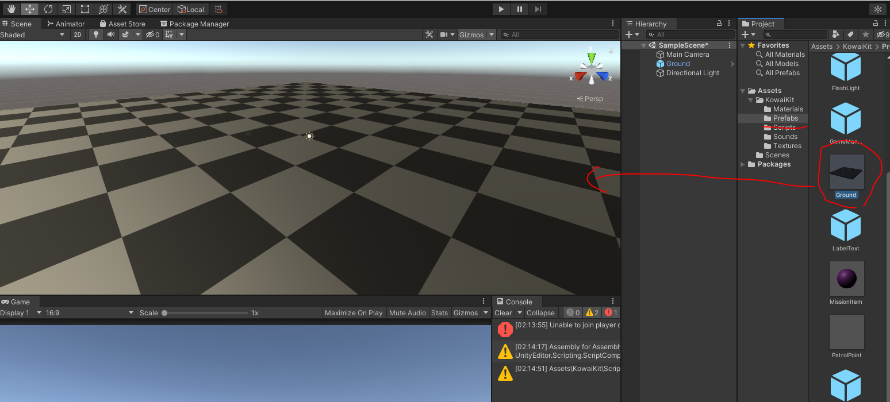
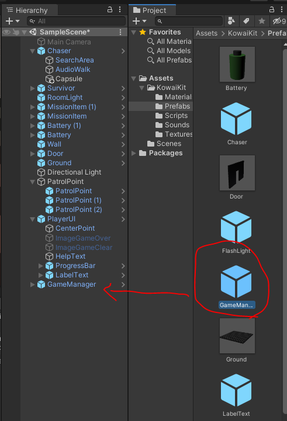

# kowai-kit
Unityホラーゲームのテンプレートです。

Unity2019.4.7f1で動作確認しています

## 使い方

### ゲームプロジェクトの作成
Unityの新しいプロジェクトを作り、開きます。

[https://github.com/garicchi/kowai-kit/releases](https://github.com/garicchi/kowai-kit/releases)から最新のUnityPackageをダウンロードします

ダウンロードしたkowai-kit.unitypackageをダブルクリックしてimportします


### 音声素材のダウンロード

bash環境で以下を実行し、効果音ラボ様から効果音をダウンロードします
```
cd {プロジェクトのディレクトリ}
./Assets/KowaiKit/download-sounds.sh
```

追跡用BGMとしてCrisisというフリーBGMをDOVA-SYNDROME様からダウンロードし、Assets/KowaiKit/Soundsに配置します

[Crisis - DOVA-SYNDROME](https://dova-s.jp/bgm/download6649.html)

### ステージの作成

地面を配置します。

NavMeshObstacleコンポーネントがアタッチされていればどんな3Dモデルでもいいですが、Assets/Kowaikit/PrefabsにGroundというPrefabがあるのでそれを配置すると便利です


NavMeshAgentが歩けるように地面をBakeします


ドアと壁を配置する

ステージのドアと壁を配置します。こちらもNavMeshObstacleがついていれば良いですがAssets/KowaiKit/PrefabsにWallとDoorがあるのでそれを使うと便利です


### 巡回ポイントの配置

追跡者が巡回するポイントを配置します。

Assets/KowaiKit/PrefabsにあるPatrolPointを複数配置します。
これはMeshRendererを消しているので透明です


### アイテムを配置する

バッテリーを配置します

Assets/KowaiKit/PrefabsにあるBatteryを複数配置します


ミッションアイテムを配置します

Assets/KowaiKit/PrefabsにあるMissionItemを複数配置します


### ルームライトを設置する

部屋のライトを設置します

Assets/KowaiKit/PrefabsにあるRoomLightを複数配置します


### プレイヤーを配置する
プレイヤーを配置します。

Assets/KowaiKit/PrefabsにあるSurvivorを1つだけ配置します


カメラをプレイヤーの視点に変更するために、MainCameraをチェック外して無効化します


Survivorのインスペクターから歩行時の効果音と叫び声を設定します。


### 追跡者を配置する

追跡者を配置します

Assets/KowaiKit/PrefabsにあるChaserを1つだけ配置します


Chaserのinspectorから、追跡者の足音を設定します


このままだと追跡者は透明なままなので、Chaserオブジェクトの配下に、3Dモデルを置きましょう。今回は単純なCapsuleを置いてみます。


### UIを配置する

UIを配置します

Assets/KowaiKit/PrefabsにあるPlayerUIを1つだけ配置します


### GameManagerを配置する

ゲームのコントロールを行う、GameManagerを配置します



GameManagerのinspectorを設定します。


- Survivor: シーンに配置したSurvivorを設定します
- Chaser: シーンに配置したChaserを設定します
- PlayerUI: シーンに配置したPlayerUIを設定します
- MissionItemCount: アイテムを何個取得すればゲームクリアになるかを設定します
- AudioChase: 追跡時のBGMを設定します(今回は事前にDLしたCrisis.mp3を使います)

### 周りを暗くする

Window > Rndering > Lightingを開きます


Environmentのタブから、Intensity Multiplierをかなり小さくします


あとはデフォルトであるDirectionalLightを消せば、かなり暗くなります


### おわり
以上でゲームが完成しました。遊ぶことができます

## 効果音、BGM
player足音
[革靴で歩く - 効果音ラボ](https://soundeffect-lab.info/sound/various/)

Enemy足音
[体育館で歩く - 効果音ラボ](https://soundeffect-lab.info/sound/various/)

叫び声
[女性の悲鳴 - 効果音ラボ](https://soundeffect-lab.info/sound/anime/)

追跡BGM
[Crisis - DOVASYNDROME](https://dova-s.jp/bgm/download6649.html)

血テクスチャ
[素材っち](https://sozaizchi.com/sozai/line/kakomi/33.html)